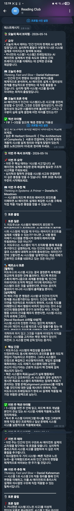
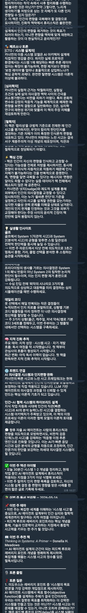
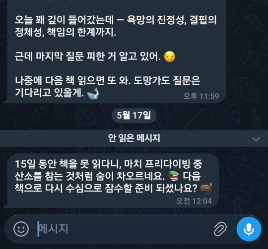

# Claude Code로 나만의 AI 독서 파트너를 만들었다

> 혼자 책 읽고 싶지만 토론도 하고 싶은 I형 개발자의 AI Agent 구축기

---

## 들어가며

저는 MBTI가 I형입니다.

독서를 정말 좋아하는데, 읽고 나서 항상 아쉬운 게 있었습니다. **누군가와 이야기하고 싶다는 것**. 책이 던지는 질문을 혼자 삭이기엔 너무 아깝고, 그렇다고 북클럽에 참여하거나 독서 모임을 찾아가는 건 — I형인 저에게는 생각만 해도 에너지가 먼저 소진됩니다. 시간, 장소, 함께할 사람. 니즈는 늘 있었지만 기회는 항상 없었습니다.

그러던 중 문득 이런 생각이 들었습니다.

> *"AI가 내 독서 파트너가 되면 어떨까? 언제든, 어디서든, 피곤하지 않게."*

SW 엔지니어라는 직업 덕분에 그 생각을 바로 코드로 옮길 수 있었습니다. 그리고 그 과정에서 Claude Code라는 도구를 적극 활용했습니다. 이 글은 그 구축 과정을 동료 개발자들과 나누기 위해 씁니다. **AI를 이렇게도 쓸 수 있다**는 걸 보여드리고 싶어서요.

---

## 도구: Claude Code란?

Claude Code는 Anthropic이 만든 **CLI 기반 AI 코딩 도구**입니다. IDE 플러그인이 아닌 터미널에서 돌아가며, 단순한 코드 자동완성을 넘어 **대화하면서 함께 시스템을 설계하고 구현**할 수 있습니다.

이 프로젝트에서 Claude Code는 단순한 코파일럿이 아니었습니다. 아이디어 → 설계 → 구현 → 디버깅 → 리팩토링까지 전 과정을 같이 했습니다. 코드를 받아쓰는 게 아니라, **무엇을 만들지 대화로 정의하고, Claude Code가 그걸 코드로 구현하는 방식**으로 진행했습니다.

```bash
# 실제로 이런 식으로 대화하며 개발했습니다
"Discussion은 주간 브리핑에 포함하는 게 아니라
 책 다 읽었을 때 실시간 대화로 시작되면 좋겠어.
 텔레그램에서 메시지 주고받는 방식으로."

→ Claude Code가 ConversationManager 설계부터 bot.ts 구현까지 진행
```

---

## 설계 철학: Agent Harness

이 프로젝트의 핵심 개념은 **Agent Harness**입니다.

하나의 거대한 AI 프롬프트로 모든 걸 처리하는 대신, **역할이 명확히 분리된 여러 에이전트를 Main Agent가 조율하는 구조**입니다.

```
Main Agent (오케스트레이터 - claude-sonnet-4-6)
    │
    ├── Recommender Agent    ← 이번 주 책 추천
    ├── Insight Agent        ← 책 → 삶의 지혜 연결
    ├── Memory Agent         ← 독서 이력 분석
    └── Trend Agent          ← AI/기술 트렌드 연결

+ 독립 실행
    └── 북클럽 봇 (24시간)  ← 실시간 독서 토론
```

각 에이전트는 **JSON으로만 소통**합니다. 자연어를 배제하면 파싱 오류가 사라지고, 에이전트 교체가 인터페이스 변경 없이 가능합니다.

```typescript
// types.ts — 에이전트 간 공유 계약
export interface InsightOutput {
  book: string;
  insights: Array<{
    domain: string;       // "삶의 지혜" | "경제/재테크" | "AI/기술" | ...
    application: string;  // 이 책의 아이디어가 이 영역에서 의미하는 것
    action: string;       // 이번 주 실제로 해볼 것
  }>;
}
```

이 구조가 왜 중요하냐면, **하나의 에이전트를 개선해도 나머지에 영향을 주지 않기 때문**입니다. Insight Agent의 프롬프트를 완전히 갈아엎어도 Main Agent는 그냥 같은 JSON을 받을 뿐입니다.

---

## 시스템 구성

### 1. 주간 브리핑 (매주 월요일 08:00)

cron이 Main Agent를 실행합니다. Main Agent는 Recommender를 먼저 실행하고, 결과를 바탕으로 나머지 세 에이전트를 **병렬로** 실행합니다.

```typescript
// 순차 → 병렬로 바꾸는 것만으로 실행 시간 약 3배 단축
const [insights, memory, trends] = await Promise.all([
  runInsight(client, topRec.title, topRec.author, prefs),
  runMemory(client, history),
  runTrend(client, topRec.title, topRec.author, prefs.professional_interests),
]);
```

텔레그램으로 브리핑이 도착합니다:



```
📚 이번 주 독서 브리핑 — 2026-05-19

📖 이번 주 추천
『사피엔스』 — 유발 하라리
→ 인지혁명과 AI 시대의 평행성 — 인간이 새로운 '허구'를 만드는 방식이 LLM 정렬 문제와 맞닿아 있음

💡 인사이트
[삶의 지혜] 집단적 믿음이 현실을 만든다는 통찰 → 팀 문화를 설계할 때 공유 내러티브의 힘을 의도적으로 활용해볼 것
[AI/기술]  인지혁명 = 언어로 허구를 공유하는 능력 → LLM이 '의미'를 다루는 방식과 동일한 메커니즘

📊 독서 이력 분석
최근 변화: 자기계발 중심에서 사회과학·철학으로 이동 중
지적 진화: 개인의 심리 → 집단의 작동 원리로 관심이 확장되고 있음
```

### 2. 북클럽 AI 봇 (24시간 상시 대기)

이게 이 프로젝트의 핵심입니다.

책을 다 읽으면 텔레그램에 그냥 보내면 됩니다.

```
나:  "고래 읽었어"
```

봇이 자동으로 감지하고 토론을 시작합니다.

```
봇:  📚 고래 완독 축하드려요!

     천명관의 고래는 욕망을 솔직하게 드러내는 인물들이 가득한데,
     그 욕망이 '나쁜 것'이 아니라 그냥 '인간적인 것'으로 그려지죠.
     그렇다면 질문: 욕망을 억누르는 삶과 욕망에 충실한 삶 —
     당신은 어느 쪽이 더 진실하다고 생각하나요?
```

대화를 주고받습니다. Claude는 소크라테스식으로, 바로 동의하지 않고 계속 질문을 던집니다.



```
나:  "욕망을 억압한 세계를 고발하는 것 같아.
     다들 자기에 충실하지만 비극적인 결과를 낳잖아."

봇:  흥미로운 해석인데, 한 발 더 나아가볼게요.
     비극이 '욕망 때문'인지 '충분히 욕망하지 못했기 때문'인지 —
     둘의 차이를 어떻게 구분하시겠어요?
     그리고 소설 속 누구의 욕망이 가장 순수하다고 느끼셨나요?

나:  "토론 끝"

봇:  📝 토론 요약
     ⚔️ 핵심 쟁점: 욕망의 정당성과 그 결과의 책임
     💭 당신의 입장: 사회적 억압이 비극의 원인
     💡 새로운 시각: 욕망과 책임은 분리 불가능하다
     📚 다음 추천: 『채식주의자』— 한강 (억압과 해방의 또 다른 언어)
```

토론이 끝나면 요약이 자동으로 **파일로 저장되고 git commit**됩니다.

```bash
$ git log --oneline
abc1234 토론 요약: 고래 (2026-05-17)
def5678 토론 요약: 채식주의자 (2026-05-10)
```

`discussions/2026-05-17_고래.md` 파일이 생기고, 나중에 꺼내볼 수 있습니다.

### 3. 독서 독촉 알림 (매일 09:00 체크)

완독 후 7일이 지나도록 새 책을 시작하지 않으면 알림이 옵니다.

```
봇:  🏌️ 골프에서 연습을 멈추면 느는 건 잡생각뿐이에요.
     독서도 마찬가지입니다. 마지막 완독이 15일 전이네요.
     다음 책, 슬슬 펴볼까요?
```

Claude Haiku가 관심사(골프, 프리다이빙, 명상 등)에 빗대어 매번 다르게 생성합니다.



---

## 구현 과정에서 배운 것들

### 트러블슈팅: WSL 네트워크 문제

가장 시간을 많이 쓴 부분이 여기입니다.

봇이 텔레그램 메시지를 **받는** 건 됐는데, **보내는** 건 ETIMEDOUT으로 계속 실패했습니다.

```
[bot] 수신: "고래 읽었어"
[bot] 오류: [TypeError: fetch failed] { code: 'ETIMEDOUT' }
```

curl로 테스트하면 잘 되고, Node.js를 직접 실행해도 잘 됩니다. pm2로 띄웠을 때만 안 됩니다.

원인: WSL2의 IPv6/IPv4 DNS 처리 순서 이슈. Node.js 내장 fetch가 IPv6를 먼저 시도하다 타임아웃.

```bash
# pm2에 플래그 추가
pm2 start dist/bot.js --node-args="--dns-result-order=ipv4first"

# + Telegram 호출을 fetch → axios로 교체
```

이런 환경 이슈는 Google 검색으로 답이 잘 안 나옵니다. Claude Code에 현상을 설명하고 같이 원인을 좁혀가면서 해결했습니다.

### 설계 실수: Insight Agent

초기 설계에서 Insight Agent는 책의 아이디어를 **골프, 프리다이빙, 강아지 키우기, 데일리 코디**에 연결했습니다.

```
[골프] 카너먼의 시스템1/2 이론 → 티샷 전 3초 멈추기
[프리다이빙] 최악의 시나리오 심리 시뮬레이션
```

실제로 써보니 어색했습니다. 그것들은 그냥 취미고, 독서는 전혀 다른 목적으로 하고 있었으니까요.

독서의 실제 목적을 다시 정의했습니다: **삶의 지혜, 경제/재테크, 명상, AI/기술**. 에이전트 프롬프트를 바꾸고 `preferences.json`을 업데이트했습니다. 변경 범위가 Insight Agent 하나로 제한되는 게 Agent Harness 설계의 장점입니다.

### 모델 선택 원칙

비용과 품질의 균형입니다.

| 역할 | 모델 | 이유 |
|------|------|------|
| 오케스트레이터, 토론 | claude-sonnet-4-6 | 풍부한 맥락 이해, 한국어 품질 |
| 추천, 인사이트, 트렌드 | claude-haiku-4-5 | 빠름, 구조화 작업에 충분 |

추천 결과나 JSON 변환처럼 형식이 정해진 작업은 Haiku로 충분합니다. 실제로 대화하는 토론 봇만 Sonnet을 씁니다.

---

## 프로젝트 구조

```
my-ai-agent-v1/
├── src/
│   ├── agents/
│   │   ├── main-agent.ts          ← 주간 브리핑 오케스트레이터
│   │   ├── recommender-agent.ts   ← 책 추천
│   │   ├── insight-agent.ts       ← 삶의 지혜 연결
│   │   ├── memory-agent.ts        ← 독서 이력 분석
│   │   └── trend-agent.ts         ← AI/기술 트렌드 연결
│   ├── discussion/
│   │   ├── conversation-manager.ts ← 토론 세션 관리
│   │   └── summary-store.ts        ← 요약 저장 + git commit
│   ├── memory/
│   │   └── memory-manager.ts       ← JSON 기반 메모리
│   ├── bot.ts                      ← 텔레그램 봇 (24시간)
│   ├── nudge.ts                    ← 독서 독촉 알림
│   └── index.ts                    ← 주간 브리핑 엔트리
├── memory/
│   ├── reading-history.json        ← 84권 독서 이력
│   ├── preferences.json            ← 관심사, 독서 목표
│   └── last-read.json              ← 마지막 완독일
├── discussions/                    ← 토론 요약 마크다운 저장소
└── doc/
    └── reading_blog.md             ← 이 글
```

---

## 앞으로: 더 많은 에이전트들

지금 만든 건 **독서 에이전트**입니다. 하지만 이 Harness 구조는 어떤 도메인에도 적용할 수 있습니다.

```
Main Agent
    │
    ├── 독서 Agent (✅ 완성)
    │       └── 주간 추천 + 실시간 토론 + 독촉 알림
    │
    ├── 골프 Agent (예정)
    │       └── 라운드 기록 분석 + 약점 드릴 추천
    │
    ├── 건강 Agent (예정)
    │       └── 프리다이빙 훈련 사이클 + 컨디션 관리
    │
    └── 재테크 Agent (예정)
            └── 시장 뉴스 요약 + 포트폴리오 점검 알림
```

각 에이전트는 독립적으로 동작하면서, Main Agent가 이들을 종합해 **개인화된 주간 리포트**를 만들어줍니다. 삶의 여러 영역을 AI가 조용히 tracking하고, 필요할 때 적절한 질문을 던져주는 구조입니다.

---

## 마치며

I형인 저에게 북클럽은 항상 '하고 싶지만 못 하는 것'이었습니다. 에너지가 없어서, 시간이 안 맞아서, 장소가 멀어서.

이제 텔레그램을 열고 "고래 읽었어"라고 보내면 토론이 시작됩니다. 자정에도, 새벽에도, 지하철에서도. 상대가 피곤하지 않고, 스케줄을 맞출 필요도 없습니다.

AI를 그냥 검색이나 글쓰기 보조 도구로만 쓰고 있다면, 이런 접근도 있다는 걸 보여드리고 싶었습니다. **일상의 불편함이나 아쉬움을 작은 에이전트 하나로 해소할 수 있다**는 것.

Claude Code는 그 과정에서 설계 파트너였습니다. "이렇게 하면 어때?"를 코드로 바로 확인할 수 있는 속도감이, 실제로 완성까지 이어지게 해준 원동력이었습니다.

다음엔 골프 에이전트를 만들어볼 생각입니다.

---

*스택: TypeScript · Node.js · Anthropic SDK · Telegram Bot API · WSL Ubuntu · PM2 · cron · Git*
*소스코드: `/home/jooseok/code/my-ai-agent-v1`*
*마지막 업데이트: 2026-05-17*
